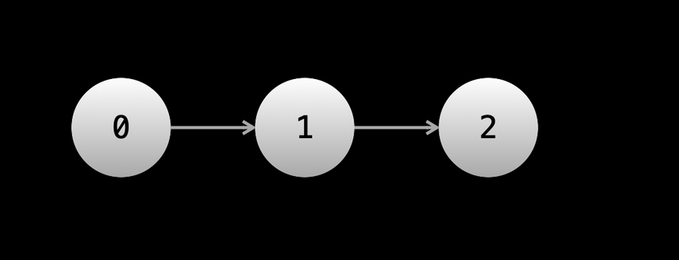
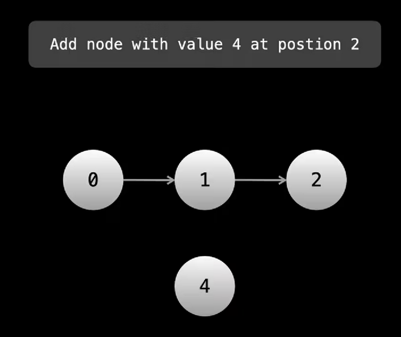

#### Q1:Create the following Linked List in js 



**Solution**:

```js
class ListNode {

  constructor(val) {

    this.val = val;

    this.next = null;

  }

}

(function main() {

  let zero = new ListNode(0);

  let one = new ListNode(1);

  let two = new ListNode(2);

  zero.next = one;

  one.next = two;

  let head = zero;

  console.log(zero.val + "->" + one.val + "->" + two.val);

})();
```

#### Q2:Advantages of Linked List compared to arrays 

**Solution**:

1. We can add and remove elements at any position in O(1) .The caveat is that we need to have a reference to a node at the position in which we want to perform the addition/removal otherwise the operation is O(n) because we will need to iterate starting from the head until we get to th desired position 
2. LinkedList have the adavantage of not having fixed sizes .While dynamic arrays can be resized under the hood they still are allocated a fixed size - its just that when this size is exceeded the array is resized which is expensive  

#### Q3:Disadvantages of Linked Lists compared to arrays 

**Solution**:

1. Arrays has O(1) indexing , a LinkedList could require O(n) to access an element at a given position 
2. Linked Lists have more overhead than arrays - every element needs to have extra storage for the pointers 

#### Q4: Is the following statements correct ? 

**Variables remain at nodes unless they are modified**

**Solution**:


```js
let ptr = head;
head = head.next;
head = null;
```

After these lines of code , ptr still refers to the original head node even though the head variable changed variables remain at nodes unless they are modified directly (ptr = something is the only way to modify ptr)

#### Q5:Is the following statement correct ? 

**If we have multiple .next for example *head.next.next* evrything before the final .next refers to one node**

**Solution**:

If you have multiple `.next`, for example `head.next.next`, everything before the final `.next` refers to one node. For example, given a linked list `1 -> 2 -> 3`, if you have `head` pointing at the first node, and you do `head.next.next`, you are actually referring to `2.next`, because `head.next` is the `2`

#### Q6:Get the sum of the following Linked List 


```js
let getSum = (head)=>{ 

}
```

**Solution**:

```js
let getSum = (head) => {

  let dummy = head;

  let sum = 0;

  while (dummy) {

    sum += dummy.val;

    dummy = dummy.next;

  }

  return sum;

};


```

Time : O(n)

Space:O(1)

#### Q6:Add node with value 4 at position 2 



```js
class ListNode {
    constructor(val) {
        this.val = val;
        this.next = null;
    }
}

// Let prevNode be the node at position i - 1
let addNode = (prevNode, nodeToAdd) => {
}
```

**Solution**:

```js
class ListNode {

  constructor(val) {

    this.val = val;

    this.next = null;

  }

}

// Let prevNode be the node at position i - 1
let addNode = (prevNode, nodeToAdd) => {

  nodeToAdd.next = prevNode.next;

  prevNode.next = nodeToAdd;

};
```

Time Complexity : O(1)

Space Complexity : O(1)

#### Q7:Delete the element at position i , prevNode at position i-1 is given 

```js
class ListNode {
    constructor(val) {
        this.val = val;
        this.next = null;
    }
}

// Let prevNode be the node at position i - 1
let deleteNode = prevNode => {
    prevNode.next = prevNode.next.next;
}


```

**Solution**:

```js
class ListNode {
    constructor(val) {
        this.val = val;
        this.next = null;
    }
}

// Let prevNode be the node at position i - 1
let deleteNode = prevNode => {
    prevNode.next = prevNode.next.next;
}
```

Time Complexity : O(1)

Space Complexity :O(1)

